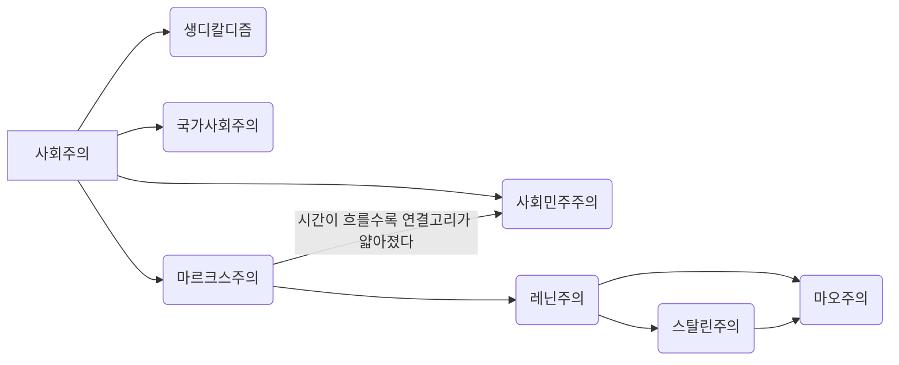

이 둘의 관계는 생각보다 간단하다, 이부분에서 사람들은 오인하는 점이 있다. **"공산주의가 사회주의 아님?"**
물론 둘의 연관성이 없는건 아니지만 사회주의는 생디칼디즘,사회민주주의,공산주의,국가사회주의(물론 여기서 지칭하는 국가사회주의는 국가사회주의 독일 노동자당 즉,나치당의 National socialism이 아닌 독일제국의 전수상인 비스마르크가 주창한 state socialism을 의미한다)을 통칭해서 부르는 말이고 공산주의는 이중에서 하나의 분파에 불과하다

#더 있지만 여기서는 언급한 사상만 써놓겠다

